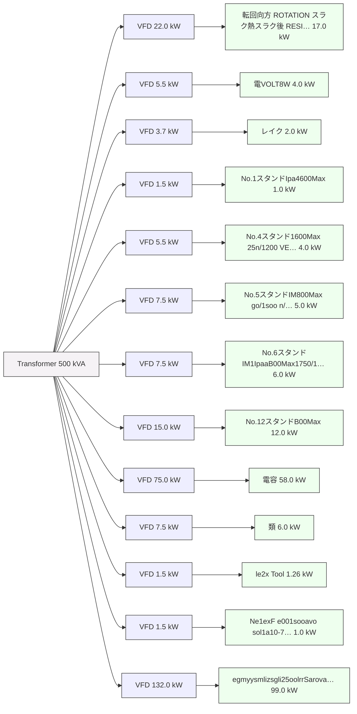

```mermaid
flowchart LR
  TX[Transformer 500 kVA]:::tx
  INV1[VFD 22.0 kW]
  M1[転回向方 ROTATION スラク熱スラク後 RESI… 17.0 kW]
  INV2[VFD 5.5 kW]
  M2[電VOLT8W 4.0 kW]
  INV3[VFD 3.7 kW]
  M3[レイク 2.0 kW]
  INV4[VFD 1.5 kW]
  M4[No.1スタンドIpa4600Max 1.0 kW]
  INV5[VFD 5.5 kW]
  M5[No.4スタンド1600Max 25n/1200 VE… 4.0 kW]
  INV6[VFD 7.5 kW]
  M6[No.5スタンドIM800Max go/1soo n/… 5.0 kW]
  INV7[VFD 7.5 kW]
  M7[No.6スタンドIM1IpaaB00Max1750/1… 6.0 kW]
  INV8[VFD 15.0 kW]
  M8[No.12スタンドB00Max 12.0 kW]
  INV9[VFD 75.0 kW]
  M9[電容 58.0 kW]
  INV10[VFD 7.5 kW]
  M10[類 6.0 kW]
  INV11[VFD 1.5 kW]
  M11[le2x Tool 1.26 kW]
  INV12[VFD 1.5 kW]
  M12[Ne1exF e001sooavo sol1a10-7… 1.0 kW]
  INV13[VFD 132.0 kW]
  M13[egmyysmlizsgli25oolrrSarova… 99.0 kW]
  TX --> INV1:::inv
  INV1 --> M1:::m
  TX --> INV2:::inv
  INV2 --> M2:::m
  TX --> INV3:::inv
  INV3 --> M3:::m
  TX --> INV4:::inv
  INV4 --> M4:::m
  TX --> INV5:::inv
  INV5 --> M5:::m
  TX --> INV6:::inv
  INV6 --> M6:::m
  TX --> INV7:::inv
  INV7 --> M7:::m
  TX --> INV8:::inv
  INV8 --> M8:::m
  TX --> INV9:::inv
  INV9 --> M9:::m
  TX --> INV10:::inv
  INV10 --> M10:::m
  TX --> INV11:::inv
  INV11 --> M11:::m
  TX --> INV12:::inv
  INV12 --> M12:::m
  TX --> INV13:::inv
  INV13 --> M13:::m
  classDef tx fill:#f5f2f5,stroke:#333,stroke-width:1px;
  classDef inv fill:#eef,stroke:#333,stroke-width:1px;
  classDef m fill:#efe,stroke:#333,stroke-width:1px;
```